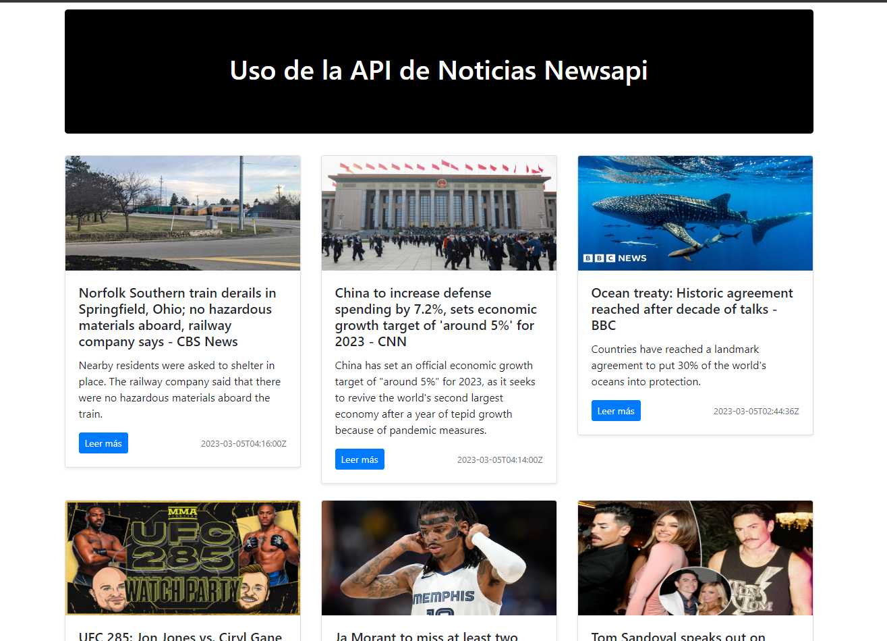

# Noticias-JPV
## Uso de la API de Noticias Newsapi con HTML, CSS Y Javascript. 
### Crear una Cuenta en https://newsapi.org/register.
### Luego solicitar una APIKey: https://newsapi.org/ y Usarla en el Codigo Proporcionado:

## Portada:

